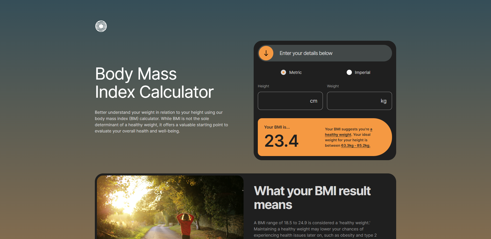
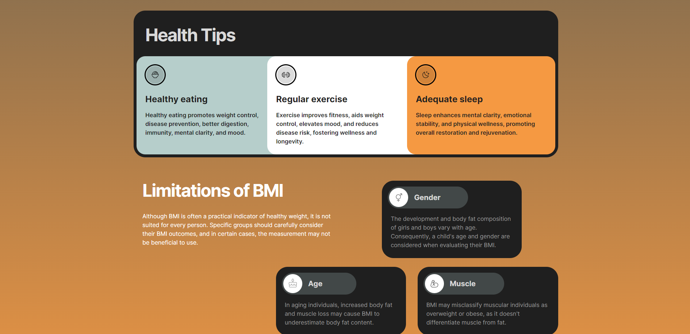

# Frontend Mentor - Body Mass Index Calculator solution

This is a solution to the [Body Mass Index Calculator challenge on Frontend Mentor](https://www.frontendmentor.io/challenges/body-mass-index-calculator-brrBkfSz1T). Frontend Mentor challenges help you improve your coding skills by building realistic projects. 

## Table of contents

- [Overview](#overview)
  - [The challenge](#the-challenge)
  - [Expected Behaviour](#expected-behaviour)
  - [Screenshot](#screenshot)
  - [Links](#links)
- [My process](#my-process)
  - [Built with](#built-with)
  - [What I learned](#what-i-learned)
  - [Useful resources](#useful-resources)
- [Author](#author)
- [Acknowledgments](#acknowledgments)

## Overview

### The challenge

Users should be able to:

- Select whether they want to use metric or imperial units
- Enter their height and weight
- See their BMI result, with their weight classification and healthy weight range
- View the optimal layout for the interface depending on their device's screen size
- See hover and focus states for all interactive elements on the page

### Expected behaviour

Below you will find the BMI ranges and their weight classifications. Based on the person's BMI results, add their weight classification onto sentence "Your BMI suggests you’re" within the results component.

- Underweight: BMI less than 18.5
- Healthy weight: BMI 18.5 to 24.9
- Overweight: BMI 25 to 29.9
- Obese: BMI 30 or greater

Add the individual's healthy weight range based on the lower and upper BMI categorisations and the person's height.

### Screenshot

- Main - 
- Sub-section - 

### Links

- Solution URL: [https://github.com/Jo-cloud85/body-mass-index-calculator.git](https://github.com/Jo-cloud85/body-mass-index-calculator.git)
- Live Site URL: [https://jo-cloud85.github.io/body-mass-index-calculator/](https://jo-cloud85.github.io/body-mass-index-calculator/)

## My process

### Built with

- Semantic HTML5 markup
- CSS custom properties
- Flexbox
- CSS Grid
- Mobile-first workflow
- [Styled Components](https://styled-components.com/) - For styles

### What I learned

I learnt a few things about the radio buttons, on how to custom them and allow for 1 radio button to be checked (or multiple, depending on future contexts).

### Useful resources

- [CSS Gradient](https://cssgradient.io/) - This helped me for XYZ reason. I really liked this pattern and will use it going forward.
- [Custom radio buttons](https://www.w3schools.com/howto/tryit.asp?filename=tryhow_css_custom_radio) - I learn how to create simple custom radio buttons.
- [Only one radio button to be checked](https://stackoverflow.com/questions/5419459/how-to-allow-only-one-radio-button-to-be-checked) - I learnt that to allow only one radio button to be checked, the radio buttons have to have the same name, and vice versa.

## Author

- Frontend Mentor - [@Jo-cloud85](https://www.frontendmentor.io/profile/Jo-cloud85)

## Acknowledgments

- [Design reference](https://dribbble.com/shots/21168731-Flight-Booking-App) 
- [Down arrow icon](<a href="https://www.flaticon.com/free-icons/down-arrow" title="down arrow icons">Down arrow icons created by Gregor Cresnar - Flaticon</a>)
- [Morning jog image](Photo by <a href="https://unsplash.com/@esdesignisms?utm_source=unsplash&utm_medium=referral&utm_content=creditCopyText">Emma Simpson</a> on <a href="https://unsplash.com/photos/mNGaaLeWEp0?utm_source=unsplash&utm_medium=referral&utm_content=creditCopyText">Unsplash</a>)
- [CSS loader by Aadil Shaik](https://uiverse.io/profile/aadil-01)